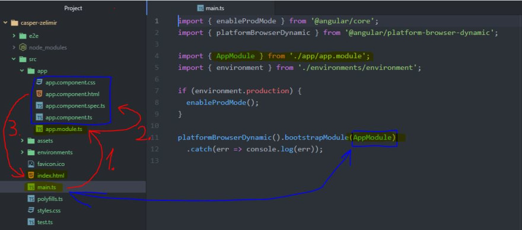

# DEC-Angular-Guillermo
## Explicacion archivos
1. **src ->** carpeta donde se encuentra en proyecto entero.
    - ***app-routing.module.ts ->*** configura las rutas del proyecto 
    - ***app.component.html ->*** componente controla un parche de la pantalla llamado vista
    - ***app.component.spec.ts ->*** archivo donde se realizan los test de la app
    - ***app.component.ts ->*** indican donde iniciar los componentes y permite al usuario etiquetar una clase como un componente angular
    - ***app.module.ts ->*** nos permite importar todos los elementos que usaremos en una aplicación angular
    - ***favicon.ico ->***  icono o símbolo que acompaña a la URL en los navegadores
    - ***index.html ->*** aplicacion raiz y donde se insterat el componente html
    - ***main.ts ->*** ese es el primer código que se ejecuta, arranca la aplicación. Carga todo y controla el inicio de la aplicación.
- {width=100px height=100px}
2. **.editorconfig ->** define estilos de codificación consistentes para múltiples desarrolladores que trabajan en el mismo proyecto con editores de texto distinto
3. **angular.json ->** valores por defecto para la configuración del proyecto angular
4. **package-lock.json ->** información de versión para todos los paquetes instalados en la carpeta node_modules
5. **package.json ->** configura las dependencias del paquete npm
6. **tsconfig.app.json ->** configuración de TypeScript específica de la aplicación, incluidas las opciones de compilación de plantillas de TypeScript y Angular.
7. **tsconfig.json ->** configuración predeterminada del lenguaje TypeScript para proyectos
8. **tsconfig.spec.json ->** configuración de TypeScript para las pruebas de aplicación.